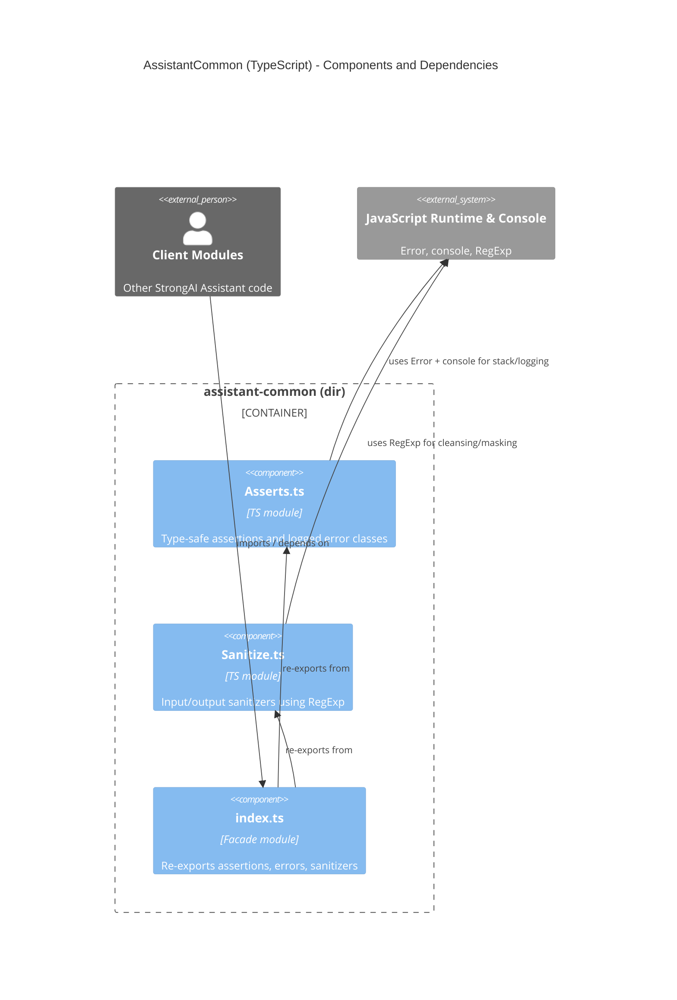

<!-- Generated by StrongAIAutoDoc 20260219 -->

AssistantCommon provides lightweight, dependency-free building blocks for correctness and safety in the StrongAI Assistant. Asserts.ts offers type-safe runtime guards and standardized, auto-logging error classes to enforce contracts and aid debugging. Sanitize.ts cleans user input and scrubs output, removing control characters, stripping tags, and masking emails, cards, and phone numbers. index.ts exposes a single import surface by re-exporting both modules, encouraging consistent usage across the codebase. The package depends only on the JavaScript runtime (Error for stack traces, console for logging, and RegExp for sanitization), forming a cohesive, reusable core with minimal external coupling.

Key components:
- Asserts.ts: Provides throwIfUndefined, throwIfNull, and throwIfFalse with TypeScript assert signatures. Defines LoggedError and specialized errors (InvalidParameterError, InvalidOperationError, ConnectionError, InvalidStateError) that standardize naming, capture V8 stacks, and log on construction.
- Sanitize.ts: sanitizeInputString normalizes and cleans raw user input. sanitizeOutputString strips tags, removes control chars (optionally preserving line feeds), and masks sensitive patterns (emails, 16–19 digit cards, US/UK-style phones).
- index.ts: Facade that centralizes imports, ensuring callers rely on one stable surface.
- External runtime: Error, console, and RegExp power stack traces, logging, and pattern-based cleansing.