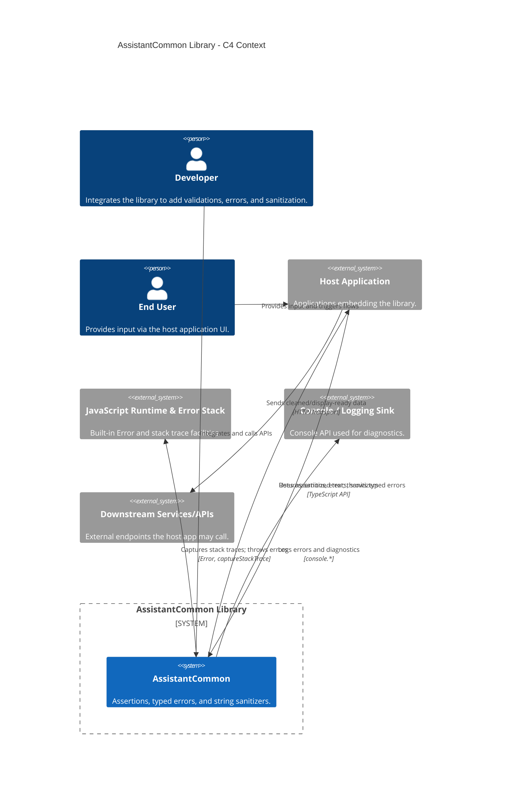

<!-- Generated by StrongAIAutoDoc 20260219 -->

This TypeScript library centralizes assertions, typed errors, and string sanitization for the StrongAI Assistant codebase. Application developers call its APIs to validate inputs, enforce invariants, and clean sensitive text before display or transmission. End users interact indirectly through host applications that embed the library. At runtime, the library relies on the JavaScript Error subsystem for stack traces and logs diagnostics to the console. Sanitized results flow back to host applications and onward to their downstream services, reducing leakage of sensitive data while improving reliability, debuggability, and safety across the broader application surface.

Key components and external interactions:
- Host Application: Primary consumer. It invokes assertion helpers to fail fast, catches well-typed errors for clearer control flow, and delegates input/output cleaning to sanitizers before display or transmission.
- JavaScript Runtime & Error Stack: Provides Error, prototype restoration, and V8-style captureStackTrace for accurate stack traces.
- Console / Logging Sink: Receives immediate diagnostic logs from LoggedError and its subclasses, improving triage.
- Developers: Integrate the library and rely on type-narrowing asserts to simplify code paths.
- Downstream Services/APIs: Indirectly benefit because sanitized output reduces data leakage and PII exposure in requests, logs, and monitoring.